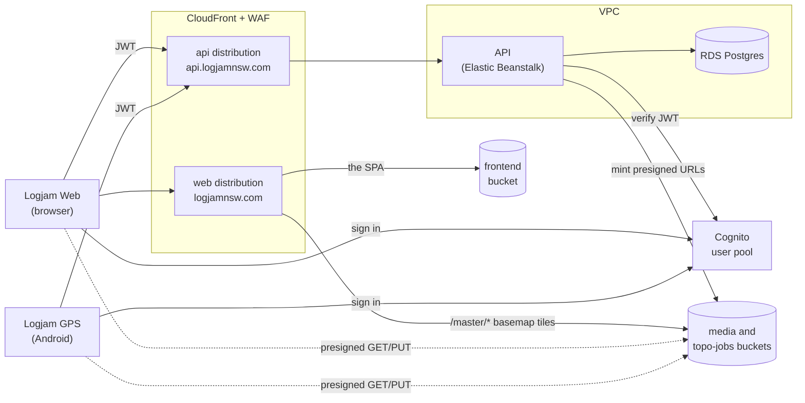
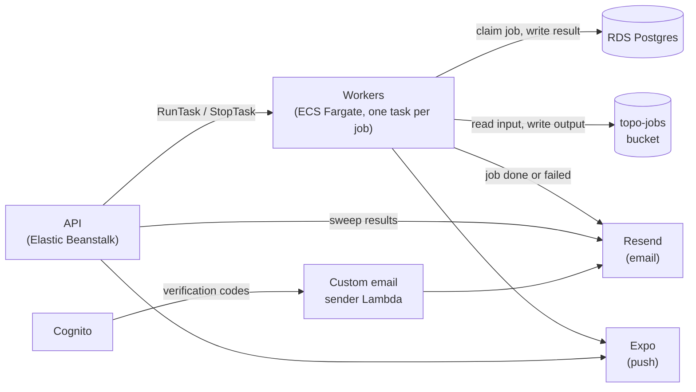
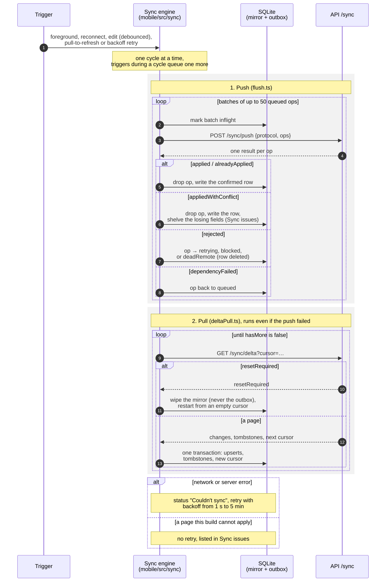
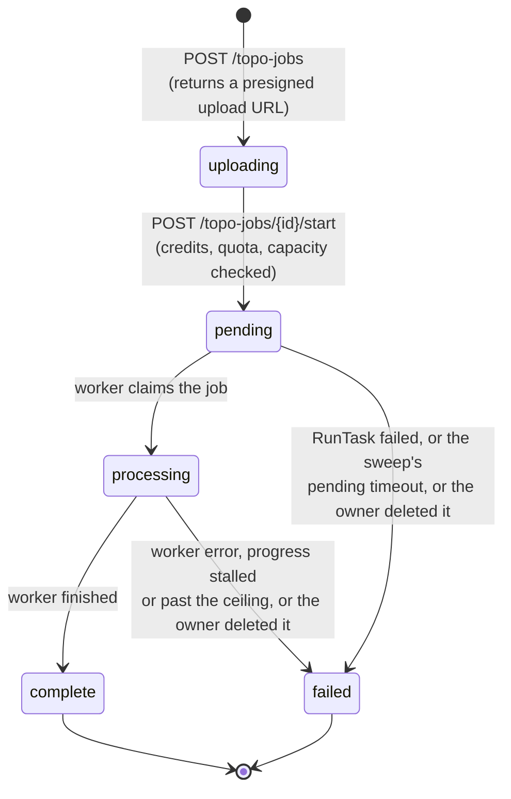
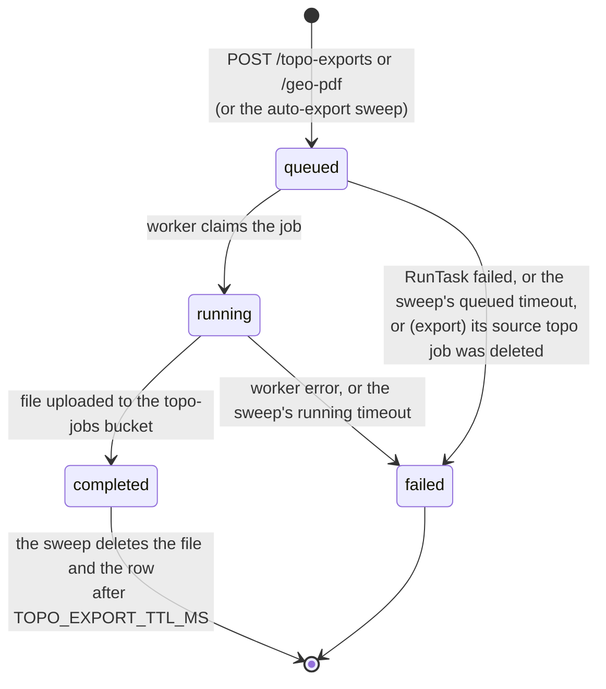

# Architecture

How Logjam runs in production, and how its main flows work. Read it once to
learn what talks to what. The rules for changing each package are in its
`AGENTS.md` (listed [at the end](#where-the-rules-live)); the reasons behind
the rules are the ADRs in [`decisions/`](decisions/README.md).

All of production is one AWS account in `ap-southeast-2` (Sydney). The only
exceptions are CloudFront, its WAF web ACLs and TLS certificate, which AWS
keeps in `us-east-1`. Terraform in
[`infra/terraform/envs/prod`](../infra/terraform/envs/prod) manages all of
it except the VPC and its subnets, which predate it and which it only
references. This page gives no ids: where you need one, it gives the
`terraform output` that prints it ([list](#looking-up-ids)). Only the public
product URLs appear literally: `logjamnsw.com` (Logjam Web) and
`api.logjamnsw.com` (the API).

## The pieces

A request from either client takes this path:

Work that outlives a request runs outside it:

**Clients.** Logjam Web is a React SPA in `frontend/`; Logjam GPS is an
Expo/React Native app in `mobile/`. Both sign in with Cognito and send its
JWT to the API. They share logic through `shared/`, not through generated
UI ([0020](decisions/0020-share-the-decision-not-the-drawing.md)).

**Edge.** Two CloudFront distributions, each behind a WAF web ACL:

- *web* serves `logjamnsw.com` (and `www.`). The default behaviour serves the
  SPA from the frontend bucket; `/master/*` serves the shared basemap tiles
  from the topo-jobs bucket. That is why the apps' topo CDN base URL
  (`terraform output topo_cdn_base_url`) is the site itself.
- *api* serves `api.logjamnsw.com` and forwards everything, uncached, to
  Elastic Beanstalk.

The API accepts only traffic that came through the *api* distribution. Two
guards enforce this: the instance's security group admits port 80 only from
CloudFront's address ranges (`envs/prod/eb.tf`), and CloudFront adds a secret
`X-Origin-Verify` header that the API checks (`envs/prod/origin_verify.tf`,
`api/src/index.ts`).

**API.** Node/Express in `api/`, one Docker container on a single-instance
Elastic Beanstalk environment (no load balancer). The container also runs the
periodic sweeps (`api/src/lib/topoJobReaper.ts`): it fails stuck jobs, expires
old exports, queues auto-exports, removes orphaned media uploads and expired
"Send a copy" files, and meters egress. A deploy briefly takes the API down.
That is why deploys smoke-test and roll back on their own
([below](#how-a-change-reaches-prod)).

**Workers.** On-demand ECS Fargate tasks, one per job, with no long-running
service. The API launches them with `RunTask` through
`api/src/lib/ecsRunTask.ts`, passing the job's id in an environment variable.
The job's row in Postgres is the only queue: there is no SQS. The task
definitions are in `envs/prod/ecs.tf`:

| Task family | Image | Runs | Launched by |
|---|---|---|---|
| `logjam-topo-worker` | topo worker (`topo/`) | `topo/worker.py`: LiDAR ZIP → tiles | `POST /topo-jobs/:id/start` (`JOB_ID`) |
| `logjam-topo-export-worker` | topo worker | `topo/export_worker.py`: tiles → download file | `POST /topo-exports`, or the auto-export sweep (`EXPORT_JOB_ID`) |
| `logjam-geo-pdf-worker` | API | `api/src/worker/geoPdfWorker.ts` | `POST /geo-pdf` (`GEO_PDF_JOB_ID`) |
| `logjam-api-migrate` | API | `prisma migrate deploy` | the API deploy workflow, before each release |

The job workers write their results straight to Postgres and S3, then
notify the user in the app, by push and by email.
[`infra/scripts/pin-release.sh`](../infra/scripts/pin-release.sh) declares
which family runs which image.

**Data.** RDS Postgres is private to the VPC (not publicly accessible). The
API and the migrate task connect as a least-privilege role over verified TLS
([0001](decisions/0001-rds-tls-via-bundled-ca.md)). The app's S3 buckets are
private. Clients read and write them only through short-lived presigned URLs,
and CloudFront reads them through origin access control:

| Bucket | Holds | `terraform output` |
|---|---|---|
| media | photos and other trip media; "Send a copy" files (expire after 8 days) | `s3_bucket_media` |
| topo-jobs | LiDAR ZIP uploads, job outputs, exports and GeoPDFs, the `/master/*` basemap | `s3_bucket_topo` |
| frontend | the Logjam Web build | `s3_bucket_frontend` |
| access logs | S3 access logs for media and topo-jobs, read by the egress meter | `s3_bucket_access_logs` |
| audit | CloudTrail and Postgres audit (pgaudit) records, object-locked (`envs/prod/audit.tf`) | `audit_bucket` |

**Auth.** One Cognito user pool. The API verifies each request's JWT against
the pool's public keys (`api/src/middleware/auth.ts`). Cognito does not send
its own email: it hands each verification code, encrypted with a KMS key, to
a custom email sender Lambda (`infra/lambda/cognito-email-sender`), which
sends it through Resend (`envs/prod/lambda_cognito_email.tf`).

**Email and push.** Job emails go through Resend (`api/src/services/email.ts`,
`topo/email_send.py`); pushes go through Expo's push service
(`api/src/services/push.ts`, `topo/push_send.py`). Both are best-effort. The
in-app notification row is the record.

**Monitoring.** CloudWatch alarms in `envs/prod/monitoring.tf` all publish to
one SNS topic, which emails the maintainer.
[`operations/alarms.md`](operations/alarms.md) lists each alarm and what to do
first. A budget alarm (`envs/prod/budgets.tf`) and a nightly drift check
(`terraform-drift.yml`, which plans `envs/prod` and `envs/github` and opens an
issue for each that differs) cover cost and hand-made changes.

## Sync

Logjam GPS keeps a local SQLite mirror so it works with no signal, and syncs
it with two endpoints in `api/src/routes/sync.ts`. Logjam Web does not sync:
it calls the REST routes directly. The wire types and constants
(`SYNC_PROTOCOL`, batch and page limits) are declared once in
`shared/src/sync.ts`.

Local edits are queued as ops in an outbox. A sync cycle pushes the outbox,
then pulls the changes made since the stored cursor:

What makes this safe to retry:

- Every op is idempotent, so a whole batch can be re-sent after a 5xx or a
  lost connection. A page and its cursor commit together, so a crash
  mid-page replays that page.
- The server asks for a reset when the cursor is from another protocol
  version or epoch, is malformed, or is older than the tombstone horizon.
  A reset rebuilds the mirror and keeps unsent edits.
- The delta endpoint takes no entity ids, only the caller's cursor. Everything
  it returns comes from what the caller may see. So it cannot confirm that an
  id exists, and an unshare looks exactly like a delete to the sharee.
  Guard: `api/src/__tests__/syncBoundary.test.ts`.
- Only the triggers above start a cycle. There is no background timer
  ([0013](decisions/0013-background-work-battery-rules.md)).

Decisions that shape sync: [0007](decisions/0007-guest-mode-is-dont-sync-yet.md)
(guest mode queues without syncing),
[0017](decisions/0017-inbox-edits-are-outbox-ops.md) (inbox edits are ops),
[0018](decisions/0018-foreign-fields.md) (values without a local definition),
[0022](decisions/0022-mobile-builds-supported-three-months.md) (which
`SYNC_PROTOCOL` versions the server keeps).

## Jobs

Every job type follows the same pattern. The API writes a row and launches a
task. The worker claims the row by a guarded status change (`… WHERE status =
<expected>`) and writes the outcome the same way. So a job that was cancelled
or reaped while its task was starting is claimed by nobody, and the worker
exits without doing anything. Apart from the worker, only the sweep and the
owner deleting a job move it out of an in-progress state. The sweep's
timeouts are the `TOPO_REAPER_*` and `GEO_PDF_*` variables in
`api/src/lib/env.ts`. When the sweep fails a job, it stops the job's task by
the task ARN saved on the row.

### Topo jobs

A user uploads an ELVIS LiDAR ZIP straight to S3, then starts the job
(`api/src/routes/topoJobs.ts`, `topo/worker.py`):

While processing, the worker records progress, and the sweep fails the job
only when that progress stops or the job passes an absolute ceiling. A slow
job that is still advancing is left alone. Nothing fails a job left in
`uploading`; its owner deletes it. Deleting a job that is still running fails
it, stops its task and then removes the row. Deleting also fails the exports
queued from the job, and is refused while one of its exports is running.
When a job with auto-export turned on completes, the sweep queues its export.

### Exports and GeoPDFs

Topo exports (`api/src/lib/topoExportLauncher.ts`, `topo/export_worker.py`)
and GeoPDFs (`api/src/routes/geoPdf.ts`, `api/src/worker/geoPdfWorker.ts`)
share one state machine:

A user can delete a `completed` or `failed` job, not a `queued` or `running`
one. The topo-jobs bucket also expires `exports/` after 7 days as a
backstop; the sweep's own expiry is the one that returns the user's storage
quota.

## How a change reaches prod

Nothing is deployed from a laptop. Merging to `main` deploys; tagging
releases Logjam GPS.

| What changed | Workflow | What happens |
|---|---|---|
| `api/` | `deploy-api.yml`, after CI passes on `main` | Build and push the API image. Pin the API-image task definitions to it. Run the migrate task and stop if it fails. Swap Elastic Beanstalk to the new version. Smoke-test it, and roll back automatically if the smoke test fails. |
| `frontend/` | `deploy-frontend.yml`, after CI passes on `main` | Build, upload to the frontend bucket, switch `index.html`, invalidate the CloudFront cache. Smoke-test, and roll back automatically if it fails. |
| `topo/` | `deploy-topo-worker.yml`, after CI passes on `main` | Build and push the worker image, then pin the topo task definitions to it. The next job runs it. |
| `infra/terraform/envs/prod/` (and `modules/`), `infra/lambda/` | `terraform-plan.yml` (`plan-prod`) on the PR, `terraform-apply.yml` (`apply-prod`) on merge | The PR gets a read-only plan as a comment. Merging applies that plan and refuses anything different ([0024](decisions/0024-prod-terraform-applies-on-merge-by-plan-fingerprint.md)). |
| `infra/terraform/envs/github/` | `terraform-plan.yml` (`plan-github`) on the PR, `terraform-apply.yml` (`apply-github`) on merge | The repository's own GitHub settings: rulesets, Environments, Actions variables, labels. The PR gets a read-only plan as a comment. Merging applies that plan and refuses anything different ([0025](decisions/0025-github-settings-in-terraform.md)). |
| Logjam GPS | `deploy-mobile.yml`, on a `mobile-v*` tag the maintainer pushes | EAS builds it; a release tag also submits a draft to Google Play. OTA updates are signed and published by hand. See [`operations/mobile-release.md`](operations/mobile-release.md). |

Migrations run before the new API version serves traffic, so every migration
must also work with the release before it
([0003](decisions/0003-pre-deploy-migrations-expand-contract.md)). The
`rollback-compat.yml` check runs the live release's tests against a PR's new
schema. For a manual rollback, see [`operations/rollback.md`](operations/rollback.md).

GitHub Actions reaches AWS through OIDC, with no stored keys. There are three
roles, all in `envs/prod/iam.tf` and `envs/prod/iam_apply.tf`:

| Role | Used by | Trusted when |
|---|---|---|
| deploy (`github_actions_deploy_role_arn`) | the deploy, deploy-guard and rollback workflows | the job runs in the `prod` GitHub Environment, which only `main` can deploy to |
| apply (`github_actions_apply_role_arn`) | `terraform-apply.yml`: `apply-prod`, and `apply-github` only to write its state; the `envs/github` drift run only to read it | the job runs in the `prod` Environment; a permission boundary denies it user data, the database, secrets and changes to itself |
| plan (`github_actions_plan_role_arn`) | `terraform-plan.yml` and the `envs/prod` drift run; for `plan-github`, only to read its state | a pull request, or `main`; read-only, and denied user data and secret values |

Logjam GPS releases use a separate `mobile-release` Environment and never
touch AWS.

`envs/github` changes GitHub, not AWS, so it reaches GitHub through two
GitHub Apps installed on this repository only, mirroring the plan and apply
roles ([0025](decisions/0025-github-settings-in-terraform.md)). Each App's
client ID is a repository variable; its private key is a secret:

| App | Used by | Key |
|---|---|---|
| plan (reads the settings, except rulesets' bypass actors) | `plan-github` | repository secret `SETTINGS_PLAN_APP_KEY`, client ID `SETTINGS_PLAN_APP_CLIENT_ID` |
| apply (admin on the settings) | `apply-github`, and the `envs/github` drift run, which needs to see bypass actors | secret `SETTINGS_APPLY_APP_KEY` of the `prod` Environment only, so only a job on `main` can mint a token; client ID `SETTINGS_APPLY_APP_CLIENT_ID` |

## Core invariants

These hold across every package. Each ADR explains why; this page does not
repeat it.

- **404, not 403.** A resource the caller cannot see gets the same 404 as one
  that does not exist, so status codes never confirm that something exists
  ([0002](decisions/0002-place-share-visibility.md)).
- **Share visibility.** What a sharee may see of a place, and what a place
  link does not grant: [0002](decisions/0002-place-share-visibility.md),
  [0016](decisions/0016-share-versus-send-a-copy.md),
  [0019](decisions/0019-place-links-grant-no-visibility.md).
- **Expand/contract migrations**, run by a gated task before the release:
  [0003](decisions/0003-pre-deploy-migrations-expand-contract.md).
- **The sync protocol** and how long the server supports old Logjam GPS
  builds: [0022](decisions/0022-mobile-builds-supported-three-months.md), with
  [0017](decisions/0017-inbox-edits-are-outbox-ops.md) and
  [0018](decisions/0018-foreign-fields.md).
- **Prod, and this repository's GitHub settings, change only through a
  merged PR**:
  [0024](decisions/0024-prod-terraform-applies-on-merge-by-plan-fingerprint.md),
  [0025](decisions/0025-github-settings-in-terraform.md), and the privacy
  rules in the root [`AGENTS.md`](../AGENTS.md#privacy).

## Looking up ids

Run these from `infra/terraform/envs/prod`, which needs the maintainer's AWS
access (`terraform init` first). The output always beats any copy of a value.

| You need | Run |
|---|---|
| Media, topo-jobs, frontend, access-log buckets | `terraform output s3_bucket_media`, `s3_bucket_topo`, `s3_bucket_frontend`, `s3_bucket_access_logs` |
| Audit bucket | `terraform output audit_bucket` |
| CloudFront distributions | `terraform output web_cloudfront_distribution_id`, `api_cloudfront_distribution_id` |
| Topo CDN base URL | `terraform output topo_cdn_base_url` |
| Elastic Beanstalk environment | `terraform output eb_environment_name`, `eb_environment_cname` |
| ECS cluster, worker subnets and security group | `terraform output ecs_cluster`, `ecs_subnets`, `ecs_security_groups` |
| ECR repositories | `terraform output ecr_api_repository_url`, `ecr_topo_worker_repository_url` |
| Database endpoint, name, master secret | `terraform output rds_endpoint`, `rds_db_name`, `db_secret_arn` |
| Cognito pool and app client | `terraform output cognito_user_pool_id`, `cognito_client_id`, `cognito_region` |
| Cognito email sender Lambda | `terraform output cognito_email_sender_function_name` |
| Alarm topic | `terraform output alerts_topic_arn` |
| GitHub Actions roles | `terraform output github_actions_deploy_role_arn`, `github_actions_plan_role_arn`, `github_actions_apply_role_arn` |

`terraform output` with no name prints them all.

## Local development

You need neither AWS nor these ids to work on Logjam. `make setup`, then
`make dev`, runs the whole stack locally. Postgres runs in Docker; MiniStack
stands in for S3 and ECS, so jobs run as local containers; and auth is faked
as the seeded user alice. `envs/local` provisions it with the same storage
module prod uses. Step-by-step setup is in `docs/dev-setup.md`.

## Where the rules live

- [`AGENTS.md`](../AGENTS.md): privacy, environments, how we work, testing.
- [`api/AGENTS.md`](../api/AGENTS.md), [`frontend/AGENTS.md`](../frontend/AGENTS.md),
  [`mobile/AGENTS.md`](../mobile/AGENTS.md), [`shared/AGENTS.md`](../shared/AGENTS.md),
  [`topo/AGENTS.md`](../topo/AGENTS.md), [`infra/AGENTS.md`](../infra/AGENTS.md):
  each package's rules and how its tests run.
- [`decisions/`](decisions/README.md): why.
- [`operations/`](operations/): alarms, rollback, drills, saved queries, mobile
  releases.
